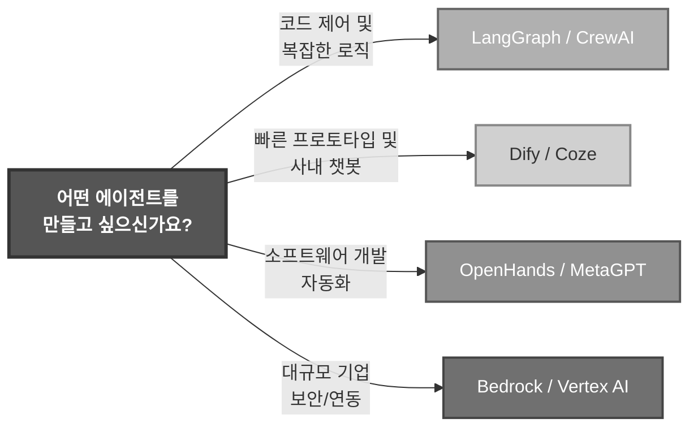

# AI 에이전트 플랫폼

## 🗺️ AI 에이전트 플랫폼 생태계 지도

```mermaid
%%{init: {'theme': 'base', 'themeVariables': { 'fontFamily': 'Arial', 'fontSize': '14px', 'primaryColor': '#E8E8E8', 'primaryTextColor': '#333333', 'primaryBorderColor': '#999999', 'lineColor': '#666666', 'tertiaryColor': '#F5F5F5', 'secondaryColor': '#D0D0D0'}}}%%
flowchart TD
    root["AI 에이전트 플랫폼 생태계"]:::root

    root --> A["코드 기반 프레임워크<br/>(Code-First)"]:::category
    root --> B["노코드/로우코드 빌더<br/>(No-Code/Low-Code)"]:::category
    root --> C["자율 개발 오픈소스<br/>(Autonomous Dev)"]:::category
    root --> D["클라우드 엔터프라이즈<br/>(Cloud/Enterprise)"]:::category

    A --> A1["LangGraph (LangChain)"]:::item
    A --> A2["CrewAI"]:::item
    A --> A3["AutoGen (Microsoft)"]:::item
    A --> A4["OpenAI Agents SDK"]:::item

    B --> B1["Dify"]:::item
    B --> B2["Coze (ByteDance)"]:::item
    B --> B3["Flowise"]:::item

    C --> C1["OpenHands (구 OpenDevin)"]:::item
    C --> C2["Open Interpreter"]:::item
    C --> C3["MetaGPT"]:::item

    D --> D1["Vertex AI Agent Builder (Google)"]:::item
    D --> D2["Bedrock Agents (AWS)"]:::item
    D --> D3["Azure AI Agent Service (MS)"]:::item

    classDef root fill:#555555,stroke:#333333,stroke-width:3px,color:#FFFFFF,font-weight:bold;
    classDef category fill:#999999,stroke:#666666,stroke-width:2px,color:#FFFFFF,font-weight:bold;
    classDef item fill:#D8D8D8,stroke:#888888,stroke-width:1px,color:#333333;
```

---

## 1. 코드 기반 에이전트 프레임워크 (Code-First)
개발자가 Python/TypeScript 코드로 에이전트의 로직, 상태, 도구(Tools)를 직접 제어하는 프레임워크입니다.

| 플랫폼명 | 개발사/주체 | 핵심 특징 및 강점 |
| :--- | :--- | :--- |
| **LangGraph** | LangChain | **상태 관리(State)** 와 **순환(Cyclic) 그래프**에 최적화. 복잡한 멀티 에이전트 워크플로우 제어에 사실상 업계 표준. |
| **CrewAI** | CrewAI Inc. | **역할(Role), 목표(Goal), 배경(Backstory)** 을 부여한 에이전트들이 팀처럼 협업하는 구조. 직관적인 API. |
| **AutoGen** | Microsoft | **멀티 에이전트 대화**에 특화. 에이전트끼리 서로 대화하며 문제를 해결하는 아키텍처. |
| **OpenAI Agents SDK** | OpenAI | 기존 **Swarm**을 공식 SDK로 승격. Handoff(제어권 이전)와 Guardrails(가드레일) 기능이 내장되어 매우 가볍고 빠름. |
| **Google ADK** | Google | Gemini 모델에 최적화된 에이전트 개발 키트. Google Cloud 생태계와 긴밀한 통합. |

---

## 2. 노코드/로우코드 에이전트 빌더 (No-Code/Low-Code)
코드를 거의 쓰지 않고, UI 드래그 앤 드롭으로 RAG 파이프라인과 에이전트를 구축할 수 있는 플랫폼입니다.

| 플랫폼명 | 개발사/주체 | 핵심 특징 및 강점 |
| :--- | :--- | :--- |
| **Dify** | Dify.ai | **픈소스 기반**의 LLMOps 플랫폼. RAG, 에이전트, 워크플로우를 시각적으로 구성하고 자체 서버에 배포 가능. |
| **Coze** | ByteDance (틱톡) | 강력한 **플러그인 및 봇 스어** 제공. 노코드지만 매우 복잡한 로직과 멀티모달 에이전트 제작이 가능. |
| **Flowise** | Flowise Inc. | **LangChain 기반**의 노코드 빌더. 로컬 환경에 쉽게 설치하여 사내 데이터와 연결된 에이전트를 빠르게 제작. |
| **Botpress** | Botpress Inc. | **채팅봇 및 대화형 에이전트**에 특화. 마케터나 기획자도 쉽게 대화 흐름을 설계할 수 있음. |

---

## 3. 자율 개발 및 오픈소스 에이전트 (Autonomous Dev)
특정 작업(주로 코딩이나 컴퓨터 제어)을 스스로 계획하고 실행하는 자율 에이전트입니다.

| 플랫폼명 | 개발사/주체 | 핵심 특징 및 강점 |
| :--- | :--- | :--- |
| **OpenHands** | Community (구 OpenDevin) | **소프트웨어 개발 자율 에이전트**. GitHub 이슈를 주면 스스로 코드를 읽고, 작성하고, PR을 생성. |
| **Open Interpreter** | Open Interpreter | 로컬 컴퓨터의 **터미널, 파일, 브라우저를 직접 제어**하는 코드 실행형 에이전트. |
| **MetaGPT** | DeepWisdom | **소프트웨어 회사를 시뮬레이션**. PM, 아키텍트, 엔지니어 등 다양한 에이전트 역할이 SOP(표준작업절차)에 따라 협업. |
| **SWE-agent** | Princeton Univ. | GitHub 이슈 해결에 특화된 연구 기반 오픈소스 에이전트. |

---

## 4. 클라우드 엔터프라이즈 에이전트 서비스
대규모 기업이 보안, 확장성, 기존 데이터 연동을 고려하여 사용하는 클라우드 네이티브 에이전트 서비스입니다.

| 플랫폼명 | 개발사/주체 | 핵심 특징 및 강점 |
| :--- | :--- | :--- |
| **Vertex AI Agent Builder** | Google | Gemini 모델과 Google Search, Enterprise Search를 결합한 엔터프라이즈급 에이전트. |
| **Amazon Bedrock Agents** | AWS | AWS 내의 Lambda, S3, Kendra 등 다양한 서비스와 네이티브하게 연동되는 에이전트. |
| **Azure AI Agent Service** | Microsoft | OpenAI 모델과 Azure DevOps, Microsoft 365(Office) 생태계를 완벽하게 통합. |
| **Agentforce** | Salesforce | CRM 데이터에 직접 접근하여 영업, 고객 지원을 자동화하는 비즈니스 특화 에이전트. |

---

## 5. 🌟 2025~2026년 핵심 트렌드: MCP (Model Context Protocol)
에이전트 플랫폼을 논할 때 현재 가장 중요한 개념은 Anthropic이 주도하는 **MCP(Model Context Protocol)** 입니다.
* **역할**: 에이전트와 외부 데이터/도구(DB, GitHub, Slack 등)를 연결하는 **USB-C 규격**과 같은 표준 프로토콜.
* **영향**: 이제 개별 플랫폼이 자체적으로 도구를 만드는 대신, **MCP 서버**를 구축하면 모든 주요 에이전트 플랫폼(Claude Desktop, Cursor, Dify 등)에서 범용적으로 도구를 호출할 수 있게 되었습니다.

---

## 💡 목적별 플랫폼 선택 가이드

1. **개발자이고 세밀한 제어가 필요하다면:** 👉 **LangGraph** 또는 **OpenAI Agents SDK**
2. **기획자/PM이고 UI로 빠르게 만들고 싶다면:** 👉 **Dify** 또는 **Coze**
3. **코딩 작업을 자동화하고 싶다면:**  **OpenHands** 또는 **Cursor (IDE)**
4. **기업의 기존 데이터와 안전하게 연동해야 한다면:**  **AWS Bedrock** 또는 **Azure AI**

찾고 계셨던 'OpenClaw'가 위 목록 중 특정 도구(예: OpenHands, OpenAI 등)를指칭하신 것이었다면, 해당 도구의 상세 아키텍처나 실습 코드가 필요하신지 말씀해 주세요! 즉시 맞춰서 정리해 드리겠습니다.
