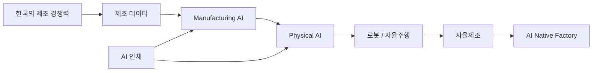
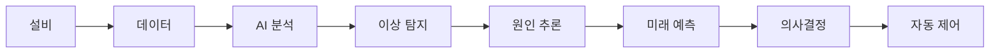
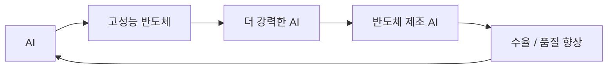
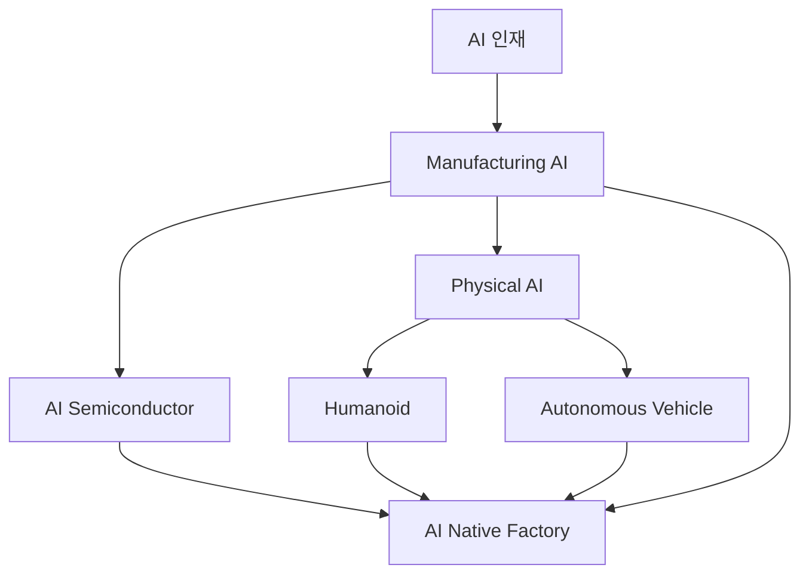
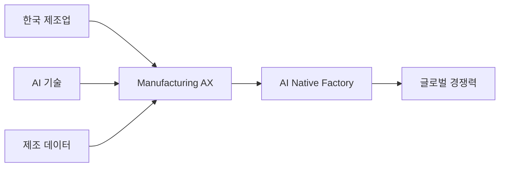
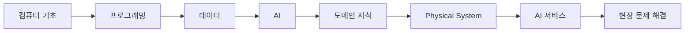
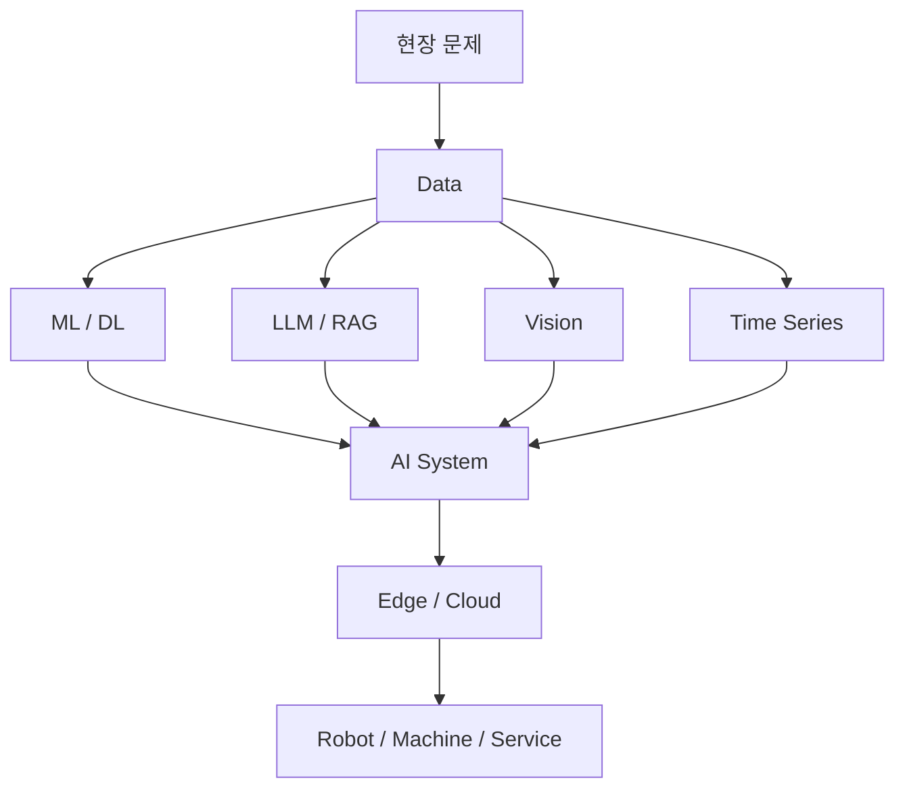
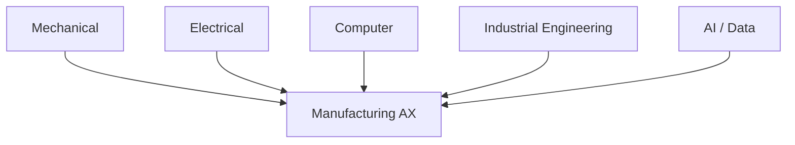
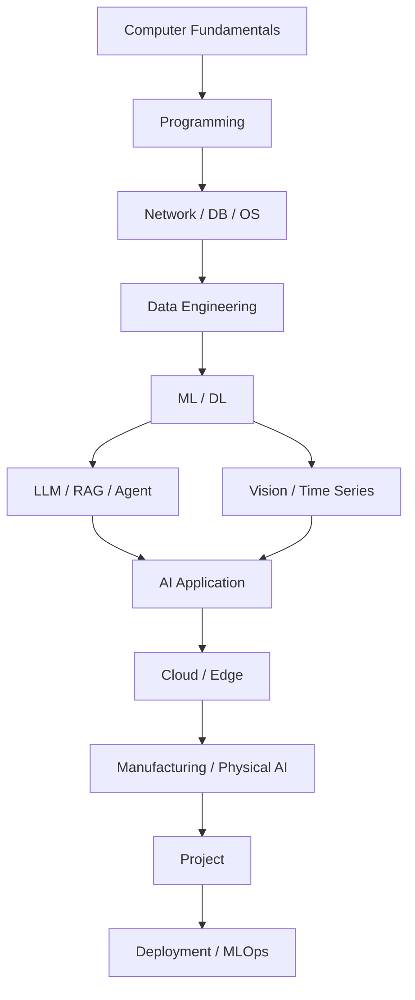
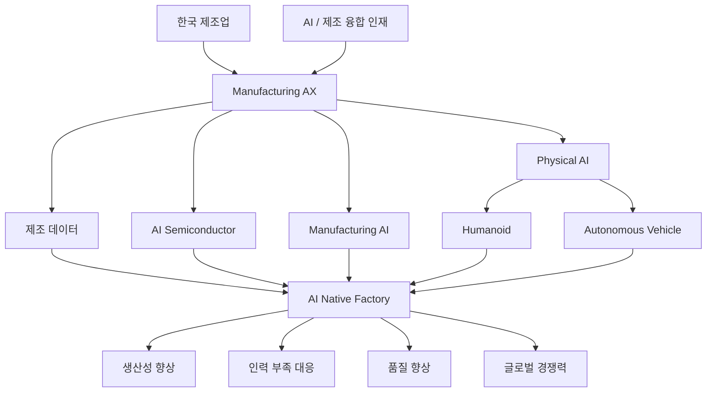

네. 링크의 영상은 **「[풀버전] AI가 한국 제조업의 미래를 바꿉니다 — 반도체·휴머노이드·자율주행·인재양성, 앞으로 10년의 승부」**로, 윤병동·김정호·엄윤설·전병욱·심성현 등 5명의 전문가가 **M.AX(Manufacturing AX, 제조업 AI 전환)**를 각자의 전문분야에서 설명하는 토론입니다. ([YouTube][1])

요청하신 대로 먼저 **① 패널 기준**, 다시 **② 내용 기준**으로 재구성하고, 마지막에는 영상에서 특히 중요한 **교육·인재양성 관점만 별도로 상세하게** 정리하겠습니다.

> 참고로 현재 웹에서 이 영상의 전체 자막 원문이 그대로 노출되지는 않아, 아래 내용은 영상의 공개 메타데이터·개별 회차 정보와 산업통상부·대학·연구기관 등 관련 공식 자료를 교차해 정리했습니다. 따라서 직접 확인되지 않은 부분을 패널의 정확한 문장처럼 인용하지 않고 핵심 주장과 맥락 중심으로 정리했습니다.

---

# 1. 먼저 이 영상 전체를 한 문장으로 요약하면

영상 전체에서 말하는 핵심은 단순히

**“제조업에 ChatGPT를 도입하자”**

가 아닙니다.

보다 정확하게는

> **한국이 이미 보유한 세계적 제조 역량과 제조 데이터를 AI·로봇·자율주행·반도체 기술과 결합하여 `AI Native Manufacturing`으로 전환해야 한다.**

는 주장에 가깝습니다.



특히 중요한 것은 **제조업의 AI 전환이 결국 사람과 교육 문제로 귀결된다**는 점입니다.

---

# 2. 1차 정리 — 패널 기준

## 2-1. 윤병동 교수 — 제조 AI / Manufacturing AX

윤병동 교수의 관점은 전체 토론의 출발점이라고 볼 수 있습니다.

관련 공개 자료에서 윤 교수는 Manufacturing AX를 단순히 공장에 개별 AI 도구를 적용하는 수준이 아니라,

**설비·공정·품질 데이터를 통합적으로 분석하고, AI가 원인을 추론하며 대응 방안까지 제시하는 단계**

로 설명합니다. ([LinkedIn][2])

### 핵심 문제

기존 스마트팩토리는 대체로

```text
센서
 → 데이터 수집
 → 모니터링
 → 이상 발생
 → 사람이 판단
```

구조였습니다.

Manufacturing AX는 이것이

```text
센서
 → 데이터
 → AI 분석
 → 원인 추론
 → 미래 예측
 → 대응안 제시
 → 자동 실행
```

으로 발전하는 것입니다.



### 윤병동 교수 관점의 중요한 포인트

한국은 미국이나 중국처럼 AI에 막대한 자본을 투입하는 방식으로만 경쟁할 필요는 없습니다.

한국에는 이미

* 반도체
* 자동차
* 조선
* 배터리
* 철강
* 기계
* 전자
* 화학

등 세계적 수준의 제조업이 존재합니다.

따라서 한국의 경쟁 자산은

> **모델 그 자체보다 제조 현장 + 제조 기술 + 제조 데이터**

일 수 있다는 것입니다. ([LinkedIn][2])

---

# 3. 김정호 교수 — AI 반도체와 국가 경쟁력

김정호 교수의 논의는 제조 AI의 **컴퓨팅 인프라** 측면으로 볼 수 있습니다.

AI가 아무리 발전해도 결국 계산은

* GPU
* HBM
* AI Accelerator
* Advanced Packaging
* Memory
* Network

등 물리적인 반도체 시스템에서 수행됩니다.

즉,


### 특히 제조 AI와 반도체가 만나는 지점

AI는 반도체를 필요로 하지만 동시에 **반도체 제조 자체도 AI의 중요한 적용 대상**입니다.

예를 들어 반도체 제조에서는

* 수율 예측
* 공정 이상 탐지
* 결함 검사
* 장비 예지보전
* 공정 조건 최적화
* 생산 일정 최적화

등을 AI로 개선할 수 있습니다.

따라서

> **AI → 반도체 발전 → 더 강력한 AI**

동시에

> **AI → 반도체 제조 혁신**

이라는 순환구조가 만들어집니다.



---

# 4. 엄윤설 대표 — 휴머노이드와 Physical AI

엄윤설 에이로봇 대표의 논의는 **디지털 AI를 현실 세계로 끌어내는 문제**입니다.

생성형 AI가

```text
텍스트
이미지
음성
코드
```

를 다뤘다면 Physical AI는

```text
보고
듣고
판단하고
움직이고
작업
```

합니다.

엄 대표의 관련 인터뷰와 산업부 자료에서는 한국 제조 현장의 인력 부족과 숙련인력 은퇴 문제를 휴머노이드와 연결합니다. 특히 **숙련공의 기술을 데이터화해 로봇이 학습할 수 있게 만드는 방향**이 강조됩니다. ([대한민국 정책브리핑][3])


### 제조업에서 휴머노이드가 중요한 이유

전통적인 산업용 로봇은

```text
고정된 장소
+
정해진 작업
+
정형 환경
```

에 강합니다.

반면 휴머노이드는 장기적으로

```text
비정형 환경
+
다양한 작업
+
인간 작업 공간
```

을 목표로 합니다.

에이로봇은 제조·조선·건설 현장 등에서 실제 적용과 PoC를 진행하고 있습니다. ([ZDNet Korea][4])

---

# 5. 전병욱 소장 — 자동차·자율주행·Physical AI

전병욱 한국자동차연구원 AI·자율주행기술연구소장의 관점에서는 자동차가 더 이상 단순한 기계 제품이 아닙니다.

자동차 산업은

```text
Mechanical Product
        ↓
Electronic Product
        ↓
Software Defined Vehicle
        ↓
AI Defined Vehicle
        ↓
Autonomous Physical AI
```

방향으로 전환되고 있습니다.

전 소장은 현재 한국자동차연구원 AI·자율주행기술연구소장을 맡고 있고, 최근에도 자율주행 산업의 경쟁력을 위해 Physical AI 활용을 강조하고 있습니다. ([KSAE][5])

### 자율주행을 기술적으로 나누면


즉 자율주행 자동차는 사실상

> **바퀴가 달린 Physical AI Agent**

라고 이해할 수도 있습니다.

---

# 6. 심성현 교수 — 제조 AX와 인재양성

교육 측면에서 이 영상에서 특히 주목해야 할 사람이 심성현 교수입니다.

심성현 교수는 산업공학·AI를 기반으로 스마트 제조, 물류, 프로세스 마이닝, 시계열 AI 등을 연구하면서 동시에 **지역 제조업의 AX와 AI 인재양성 정책을 연결하는 역할**을 하고 있습니다. ([창원대학교][6])

특히 관련 사업에서도

* 제조 데이터 활용
* AI
* 공정 자동화
* 전문인력 양성

을 함께 추진하고 있습니다. ([창원대학교][7])

여기에서 교육과 관련된 매우 중요한 메시지가 도출됩니다.

> **앞으로 필요한 AI 인재는 단순히 AI 모델을 만들 줄 아는 사람이 아니라, 제조 문제를 이해하고 AI를 적용할 수 있는 융합형 인재다.**

---

# 7. 패널별 관점을 한 번에 비교

| 패널  | 핵심 영역                  | 핵심 질문                     |
| --- | ---------------------- | ------------------------- |
| 윤병동 | Manufacturing AI       | 공장을 어떻게 AI Native화할 것인가   |
| 김정호 | 반도체·AI Computing       | AI를 구동할 계산 기반을 누가 확보할 것인가 |
| 엄윤설 | Humanoid / Physical AI | AI가 현실에서 어떻게 일하게 할 것인가    |
| 전병욱 | 자율주행 / Mobility AI     | 기계가 어떻게 스스로 인식·판단·행동할 것인가 |
| 심성현 | 제조 AX / 지역산업 / 인재양성    | 이 변화를 수행할 사람을 어떻게 양성할 것인가 |

이 다섯 분야는 독립적이지 않습니다.



---

# 8. 2차 정리 — 내용 기준

이번에는 패널이 아니라 영상 전체의 논점을 기준으로 다시 묶어보겠습니다.

## ① AI의 다음 전장은 제조업

지금까지 생성형 AI 경쟁은

```text
LLM
→ Chatbot
→ Copilot
→ Agent
```

중심이었습니다.

앞으로는

```text
AI
→ Machine
→ Robot
→ Vehicle
→ Factory
```

로 확장됩니다.

즉 **Digital AI → Physical AI**입니다.

---

# 9. ② 한국에게 제조 AI가 특히 중요한 이유

한국에는 매우 좋은 조건이 있습니다.

### 우리가 가지고 있는 것

* 세계적 제조기업
* 고도화된 생산시설
* 축적된 공정 노하우
* 반도체
* 자동차
* 조선
* 배터리
* 전자
* 산업용 로봇

따라서 AI 모델 경쟁에서 미국·중국과 정면 대결하는 것만이 전략은 아닙니다.



---

# 10. ③ 가장 중요한 자산은 제조 데이터

여기서 상당히 중요한 부분입니다.

AI 시대에는 단순히

> 데이터가 많으면 좋다

가 아니라

> **도메인을 설명할 수 있는 고품질 데이터가 중요하다**

로 바뀝니다.

윤병동 교수 관련 공개 설명에서도 제조 AX의 핵심 과제로 **AI가 학습할 수 있는 양질의 제조 데이터를 얼마나 제대로 준비하느냐**가 강조됩니다. ([LinkedIn][2])

예를 들어

```text
온도 = 82
압력 = 31
진동 = 0.82
```

라는 데이터만 있다고 충분한 것이 아닙니다.

실제로는

```text
어떤 장비인가?
어떤 제품인가?
어떤 공정인가?
정상 범위는?
왜 이상이 발생했는가?
품질과 어떤 관계인가?
작업자가 어떻게 대응했는가?
```

같은 **Context**가 필요합니다.

---

# 11. ④ 숙련공의 경험이 AI 데이터가 된다

이 부분은 교육과 직업훈련에서도 매우 중요합니다.

기존 제조업에서는 숙련자의 지식이

> **Tacit Knowledge — 암묵지**

형태로 존재합니다.

예:

> “기계 진동 소리가 평소와 조금 다르다.”

> “이 정도 온도 변화면 몇 시간 후 문제가 생긴다.”

> “제품 색을 보면 공정 조건이 잘못된 것 같다.”

AI 시대에는 이것을

```text
암묵지
↓
기록
↓
데이터
↓
지식
↓
AI 학습
↓
자동 판단
```

으로 전환해야 합니다.

엄윤설 대표 관련 정부 자료에서도 **은퇴하는 숙련공의 고도화된 기술을 데이터화하여 전수하는 방향**을 피지컬 AI의 중요한 가치로 제시합니다. ([대한민국 정책브리핑][3])

---

# 12. ⑤ 스마트팩토리와 AI Factory의 차이

이 영상의 내용을 이해할 때 이 차이가 중요합니다.

| 기존 스마트팩토리  | AI Factory  |
| ---------- | ----------- |
| 자동화        | 자율화         |
| Rule Based | AI Based    |
| 데이터 수집     | 데이터 학습      |
| 사람이 분석     | AI 분석       |
| 사람이 판단     | AI 판단 지원    |
| 예방정비       | 예지보전        |
| 산업용 로봇     | Physical AI |
| MES/ERP 중심 | AI Agent 통합 |

결국

```text
Automation
     ↓
Digitalization
     ↓
Smart Factory
     ↓
AI Factory
     ↓
Autonomous Factory
```

방향입니다.

---

# 13. ⑥ 제조업의 진짜 문제는 생산가능인구 감소

AI 도입의 목적을 단순히

> 사람을 줄이는 것

으로 이해하면 영상의 핵심을 놓칩니다.

한국 제조업에서는 오히려

```text
저출산
↓
생산가능인구 감소
↓
숙련공 은퇴
↓
현장 인력 부족
↓
생산성 저하
```

가 발생하고 있습니다.

따라서

```text
AI + Robot + Automation
```

은 노동자를 단순 대체하는 기술이라기보다는

> **부족해지는 생산 인력을 보완하고 인간의 생산성을 높이는 기술**

이라는 성격이 강합니다.

---

# 14. 이제 가장 중요한 부분 — 영상에서 도출되는 교육의 변화

교육 관점에서 이 영상은 상당히 중요한 내용을 담고 있습니다.

기존 AI 교육은 흔히 다음과 같았습니다.

```text
Python
↓
Machine Learning
↓
Deep Learning
↓
LLM
↓
Prompt
```

그러나 Manufacturing AX 시대에는 이것만으로 부족합니다.

---

# 15. 교육 패러다임의 변화

앞으로는 다음 구조가 되어야 합니다.



즉,

> **AI 자체를 배우는 교육 → AI로 현실 문제를 해결하는 교육**

으로 이동해야 합니다.

---

# 16. 가장 중요한 교육 변화 ① 도메인 교육

앞으로 제조 AI 개발자에게

```text
Python
PyTorch
LLM
LangChain
```

만 가르쳐서는 부족합니다.

예를 들어 반도체 AI 개발자라면 최소한

```text
Wafer
공정
설비
수율
Defect
센서
MES
품질관리
```

를 이해해야 합니다.

자동차 AI라면

```text
Camera
LiDAR
Radar
CAN
ECU
SDV
ADAS
Control
```

을 알아야 합니다.

즉,

> **AI 전문가 + Domain Knowledge**

형태가 필요합니다.

---

# 17. 교육 변화 ② 데이터 엔지니어링의 중요성 증가

앞으로 AI 교육에서 오히려 비중이 더 커져야 할 분야가 있습니다.

**Data Engineering**입니다.

학생들이 단순한 CSV 데이터셋을 받아 모델을 학습시키는 것만으로는 산업 AI를 이해하기 어렵습니다.

실제 제조 현장은

```text
Sensor
PLC
SCADA
MES
ERP
Log
Image
Video
Audio
Manual
PDF
Worker Knowledge
```

처럼 데이터가 분산되어 있습니다.

따라서 교육도


전체 과정을 경험하게 해야 합니다.

---

# 18. 교육 변화 ③ AI + 하드웨어

Physical AI 시대에는 소프트웨어만 아는 개발자도 한계가 있습니다.

최소한

```text
Sensor
Camera
Motor
Robot
Embedded
Edge AI
Network
Control
```

개념을 이해해야 합니다.

물론 모든 학생에게 로봇공학자가 될 수준까지 가르칠 필요는 없습니다.

하지만

> **AI가 어떤 물리 시스템 위에서 실행되는가**

는 이해해야 합니다.

---

# 19. 교육 변화 ④ LLM 중심 교육에서 AI System 교육으로

현재 AI 과정에서 흔한 형태가

```text
OpenAI API
+
Prompt Engineering
+
RAG
+
Agent
```

입니다.

이 역시 필요합니다.

그러나 제조 AX 시대의 전체 구조는 훨씬 큽니다.



즉 **LLM은 AI 시스템을 구성하는 하나의 컴포넌트**가 됩니다.

---

# 20. 교육 변화 ⑤ 프로젝트 교육이 훨씬 중요해짐

영상의 관점을 교육에 적용하면 PBL(Project Based Learning)의 중요성이 커집니다.

교육은

```text
기술을 배운 뒤 프로젝트
```

보다

```text
문제 발견
↓
요구사항
↓
데이터
↓
AI
↓
서비스
↓
현장 적용
```

과정으로 바뀌는 것이 바람직합니다.


---

# 21. 교육 변화 ⑥ 재직자 교육의 중요성

오히려 제조 AX에서 가장 중요한 학습자는 대학생만이 아닐 수 있습니다.

**현장 재직자**가 매우 중요합니다.

왜냐하면 이들은

> AI는 모르지만 제조를 잘 압니다.

반대로 AI 개발자는

> AI는 알지만 현장을 잘 모릅니다.

따라서 가장 효과적인 교육 구조는

```text
제조 전문가
      +
AI 전문가
      ↓
Manufacturing AI Team
```

입니다.

실제로 심성현 교수 관련 인재양성 사업에서도 산업체 요구 기반 PBL, 기업 취업 연계, 인턴십뿐 아니라 **재직자 교육**을 함께 추진하고 있습니다. ([RnDcircle][8])

---

# 22. 교육 변화 ⑦ 전공 간 경계가 약해진다

기존에는

```text
기계공학
전자공학
컴퓨터공학
산업공학
AI
```

가 분리되었습니다.

Manufacturing AX에서는



융합됩니다.

따라서 미래 인재는

> **T-shaped Engineer**

형태가 적절합니다.

```text
        AI
        │
        │ 깊은 전문성
────────┼────────
제조 데이터 SW HW 비즈니스
```

모든 분야의 전문가가 될 필요는 없지만

**하나의 깊은 전문성 + 주변 기술과 협업할 수 있는 이해**

가 중요해집니다.

---

# 23. 비전공자 AI 교육에는 오히려 기회가 될 수 있음

이 부분도 상당히 중요하다고 봅니다.

AI 시대에는 모든 사람이

```text
Transformer를 직접 구현하거나
CUDA kernel을 만들거나
새로운 foundation model을 개발
```

해야 하는 것은 아닙니다.

오히려 필요한 직무가 매우 다양해집니다.

예를 들어

| 직무                       | 역할           |
| ------------------------ | ------------ |
| AI Application Developer | AI 서비스 구현    |
| Data Engineer            | 제조 데이터 파이프라인 |
| AI Engineer              | 모델 개발·적용     |
| MLOps Engineer           | AI 운영        |
| AI Product Manager       | AI 제품 기획     |
| Domain AI Specialist     | 현업-AI 연결     |
| Data Curator             | 학습 데이터 관리    |
| AI Evaluator             | AI 품질 검증     |
| Knowledge Engineer       | 지식 구조화       |
| Robot AI Engineer        | Physical AI  |
| AX Consultant            | 기업 AI 전환     |

따라서 비전공자도

> **도메인 + 데이터 + AI 활용 능력**

이라는 조합으로 충분히 진입할 수 있습니다.

---

# 24. 특히 앞으로 중요해질 능력 — 문제 정의

AI 시대에는 코딩보다 오히려

> **무엇을 AI로 해결할 것인가?**

가 중요해집니다.

예를 들어 제조기업에서

> “LLM을 도입합시다.”

가 출발점이어서는 안 됩니다.

먼저

```text
불량률이 높은가?
장비가 자주 고장 나는가?
검사 인력이 부족한가?
작업 매뉴얼 검색이 어려운가?
숙련자 노하우가 사라지는가?
공정 최적화가 어려운가?
```

를 찾아야 합니다.

그 다음

```text
문제
→ 데이터
→ AI 기술
→ 서비스
```

순서로 접근해야 합니다.

---

# 25. 그래서 AX 교육과정은 이런 구조가 적절합니다

제가 이 영상의 내용을 **실제 취업교육 과정으로 변환한다면** 다음처럼 구성하는 것이 가장 적합하다고 봅니다.



### 교육과목으로 풀면

1. 컴퓨터 시스템 기초
2. Python
3. 데이터베이스 / SQL
4. 네트워크 / API
5. 데이터 수집 및 전처리
6. 머신러닝
7. 딥러닝
8. Computer Vision
9. 시계열 AI
10. LLM
11. RAG
12. AI Agent
13. FastAPI
14. React
15. PostgreSQL
16. Docker
17. Cloud
18. CI/CD
19. IoT / Sensor 기초
20. Edge AI
21. 제조 AI
22. Physical AI
23. 프로젝트

정도로 확장할 수 있습니다.

---

# 26. 기존 AI 교육과 앞으로의 AX 교육 비교

| 기존 AI 교육   | 앞으로 필요한 AX 교육              |
| ---------- | -------------------------- |
| Python     | Python + 시스템               |
| ML/DL      | ML/DL + Domain             |
| 모델 성능      | 비즈니스 효과                    |
| Kaggle 데이터 | 실제 데이터                     |
| 정형 데이터     | 멀티모달 데이터                   |
| ChatGPT    | AI System                  |
| Prompt     | Problem Solving            |
| LLM        | LLM + Vision + Time Series |
| Cloud AI   | Edge + Cloud               |
| Software   | Software + Hardware        |
| 개인 프로젝트    | 협업 프로젝트                    |
| 모델 개발      | 서비스 구축                     |
| 배포까지       | 운영·평가·개선까지                 |

---

# 27. 영상을 교육자의 관점에서 해석하면 가장 중요한 메시지

특히 이 영상을 **AI 취업교육을 설계하는 입장**에서 보면 다음 세 가지가 가장 중요하다고 생각합니다.

### 첫째, 이제 LLM만 가르쳐서는 부족합니다.

LLM/RAG/Agent는 중요하지만 AI 전체가 아닙니다.

```text
LLM
Vision
Time Series
Sensor AI
Robot AI
Edge AI
```

를 하나의 시스템 관점에서 볼 수 있어야 합니다.

### 둘째, 컴퓨터 기초가 오히려 다시 중요해집니다.

Physical AI와 Manufacturing AI로 갈수록

```text
OS
Network
Database
Hardware
Sensor
Process
Cloud
Edge
```

이해가 필요합니다.

### 셋째, 프로젝트는 “AI 기능 구현”보다 “문제 해결” 중심이어야 합니다.

예를 들어

**좋지 않은 프로젝트**

```text
ChatGPT API로 챗봇 만들기
```

보다

**좋은 AX 프로젝트**

```text
설비 매뉴얼 PDF
+
센서 로그
+
장비 이력
+
RAG
+
이상탐지 AI
+
FastAPI
+
Dashboard

→ 설비 고장 대응 Assistant
```

가 훨씬 이 영상의 M.AX 방향과 맞습니다.

---

# 28. 영상 전체의 구조를 하나로 표현하면



---

# 29. 영상에서 교육 측면만 압축하면

제가 이 영상에서 교육에 관한 핵심을 **10개 문장으로 압축하면** 다음과 같습니다.

1. **AI만 아는 사람보다 AI와 산업을 연결할 수 있는 사람이 중요해진다.**
2. 제조업의 핵심 경쟁력이 데이터로 이동하고 있으므로 **Data Literacy가 기본 역량**이 된다.
3. AI 교육은 모델 학습에서 **현장 문제 해결 교육**으로 전환되어야 한다.
4. LLM뿐 아니라 Vision·시계열·센서·로봇 AI를 함께 이해해야 한다.
5. Physical AI 시대에는 소프트웨어와 하드웨어 사이의 경계를 이해해야 한다.
6. 프로젝트 기반 학습(PBL)의 중요성이 더욱 커진다.
7. 대학생뿐 아니라 **현장 재직자의 AX 재교육**이 중요해진다.
8. 숙련자의 암묵지를 데이터와 AI 지식으로 전환하는 새로운 직무가 등장할 수 있다.
9. 기계·전자·컴퓨터·산업공학·AI가 결합된 **융합형 인재**가 필요하다.
10. 결국 미래 교육의 목표는 **코딩할 줄 아는 사람 → AI를 이용해 실제 산업 문제를 해결할 수 있는 사람**으로 이동한다.

이러한 방향은 실제로 제조 데이터 기반 AI 활용, 공정 자동화, 전문인력 양성을 함께 추진하는 지역 M.AX 사업이나 산업부의 AX 교육 정책과도 일치합니다. ([창원대학교][9])

---

## 이 영상이 현재 준비하시는 AX 교육과정에 주는 시사점

특히 최근 구성하신 **FastAPI·React·PostgreSQL·LangChain 기반 AX 풀스택 AI 서비스 스타터킷** 같은 과정은 방향 자체는 상당히 잘 맞습니다. 다만 이 영상의 관점까지 반영한다면 최종적으로는 다음과 같이 한 단계 확장하는 것이 좋습니다.

```text
현재
Full Stack
+ LLM
+ RAG
+ Agent
+ CI/CD

          ↓

향후

Full Stack
+ Data Engineering
+ ML/DL
+ LLM/RAG/Agent
+ Vision / Time Series
+ Manufacturing Data
+ Edge / Physical AI
+ CI/CD / MLOps
+ Domain Project
```

즉 앞으로의 AX 교육은 **“LLM 애플리케이션 개발자”를 양성하는 수준을 넘어 “현실의 산업 문제를 데이터와 AI로 해결하는 AI 시스템 개발자”를 양성하는 방향**으로 가는 것이 이 영상의 메시지와 가장 잘 맞습니다. ([LinkedIn][2])

원하시면 다음 단계로 이 영상의 내용을 기반으로 **「2026년 이후 AI 시대 개발자에게 필요한 역량 → 대학/취업교육에서 무엇을 가르쳐야 하는가 → 현재 AX 교육과정에서 추가·삭제해야 할 과목」**까지 연결해서, **실제 6개월짜리 교육 커리큘럼 형태**로 재구성해드릴 수 있습니다.

[1]: https://www.youtube.com/watch?v=HjmJ4eUW-E8&utm_source=chatgpt.com "자율주행·인재양성, 앞으로 10년의 승부 | 경읽남과 토론합시다"
[2]: https://kr.linkedin.com/in/emchoung?utm_source=chatgpt.com "EM CHOUNG님 - 원프레딕트 | LinkedIn"
[3]: https://www.korea.kr/multi/mediaNewsView.do?newsId=148970128&pWise=sub&pWiseSub=R4&utm_source=chatgpt.com "휴머노이드 로봇이 내 일자리를 뺏을까? 피지컬 AI가 바꿀 제조업의 미래 (ft. 에이로봇 엄윤설 대표) - 영상 | 멀티미디어 | 대한민국 정책브리핑"
[4]: https://zdnet.co.kr/view/?no=20260305095802&utm_source=chatgpt.com "엄윤설 에이로봇 대표, IFR '로봇 공학계 여성 리더' 선정 - ZDNet korea"
[5]: https://www.ksae.org/bbs/?code=member&mode=view&number=71329&utm_source=chatgpt.com "한국자동차공학회"
[6]: https://www.changwon.ac.kr/portal/na/ntt/selectNttInfo.do?mi=13606&nttSn=1381380&utm_source=chatgpt.com "CWNU 미디어 > 핫이슈 >게시물 내용보기 - 포탈시스템"
[7]: https://www.changwon.ac.kr/nptf/na/ntt/selectNttInfo.do?mi=18697&nttSn=1421995&utm_source=chatgpt.com "커뮤니티 > 핫이슈 >게시물 내용보기 - 국립대학육성사업단"
[8]: https://app.rndcircle.io/lab/736df079-18de-4246-968c-f3a003ec015a/projects?utm_source=chatgpt.com "프로젝트 | 심성현 교수 연구실 | 국립창원대학교 | 디써클"
[9]: https://www.changwon.ac.kr/international/na/ntt/selectNttInfo.do?mi=0&nttSn=1421995&utm_source=chatgpt.com "- 국제처"
